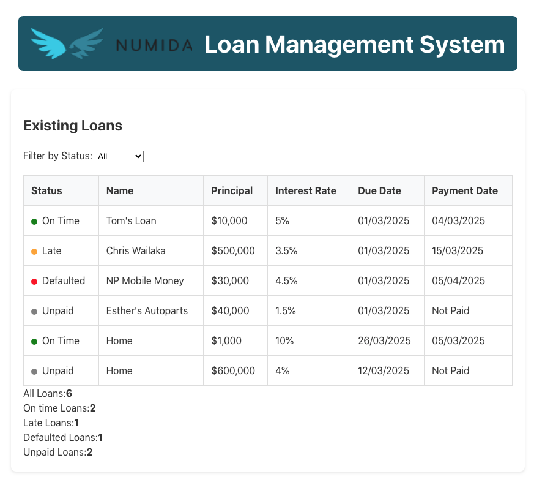

# Loan Management System



This project provides an intuitive interface for managing loans and payments with real-time updates.

## 🌟 Features

### Dynamic Loan Tracking
- View comprehensive loan details
- Track loan payment statuses
- Real-time updates using GraphQL

### Intelligent Payment Categorization
- Automatic payment status classification:
  - **On Time** (Green)
  - **Late** (Orange)
  - **Defaulted** (Red)
  - **Unpaid** (Grey)

### Responsive Design
- Seamless experience across desktop and mobile devices

### Error Handling
- Comprehensive error management
- User-friendly error messages
- Loading spinners during data fetching

## 🚀 Getting Started

### Prerequisites
- Node.js (v18.0+)
- Docker
- npm

### Installation

1. Clone the repository:
   ```bash
   git clone https://github.com/mazi76erx2/loan-management-system.git
   cd loan-management-system
   ```

2. Start the backend server:
   ```bash
   make start-server
   ```

3. Start the frontend:
   ```bash
   make install-web
   make start-web
   ```

4. Open your browser:
   - **Backend GraphQL**: [http://localhost:2024/graphql](http://localhost:2024/graphql)
   - **Frontend**: [http://localhost:3000](http://localhost:3000)

## 🫠 Technologies Used

### Frontend
- React
- TypeScript
- Apollo Client
- GraphQL
- Vite

### Backend
- Python
- Flask
- GraphQL
- Docker

### Testing
- Jest
- React Testing Library
- Unittest

## 📦 Project Structure

```
mazi76erx2-loan-app/
├── server/
│   ├── app/
│   │   ├── models/
│   │   ├── routes/
│   │   └── schema/
│   └── tests/
└── web/
    ├── src/
    │   ├── components/
    │   ├── graphql/
    │   └── utils/
```

## 🧪 Running Tests

### Backend Tests
```bash
make test-server
```

### Frontend Tests
```bash
make test-web
```

## 🌈 Key Functionalities

### Loan List
- Display all loans
- Color-coded status indicators
- Responsive table layout

### Add Payment
- Simple, intuitive form
- Validation for loan ID and payment date
- Real-time feedback

## 🔍 Payment Status Logic
- **Within 5 days of due date**: "On Time" (Green)
- **6-30 days after due date**: "Late" (Orange)
- **More than 30 days late**: "Defaulted" (Red)
- **No payment made**: "Unpaid" (Grey)

## 🚧 Future Improvements
- Implement pagination
- Add more comprehensive error handling
- Enhance test coverage
- Implement user authentication

## 📌 Improvements for a Production System

For a real-world application, several improvements should be made:

- **Database Integration**: Replace in-memory lists with a proper database (e.g., PostgreSQL, MySQL, etc.)
- **ORM**: Add an ORM for better data validation and management (e.g., SQLAlchemy, TortoiseORM, etc.)
- **Serialization**: Add serialization for better data handling and security (e.g., Marshmallow, Pydantic, etc.)
- **Data Validation**: Add robust validation for all inputs (e.g., Zod, Yup, etc.)
- **Form Library**: Use a form library for better form handling and validation (e.g., Formik, Tanstack Forms, etc.)
- **Authentication**: Implement user authentication and authorization (e.g., JWT, OAuth, etc.)
- **Cache Management**: Configure Apollo Client's cache policies for optimal performance 
- **Automatic Refetching**: Add automatic refetching after mutations to keep the UI in sync
- **Pagination**: Implement pagination for large datasets (e.g., Relay, Apollo Client's pagination)
- **Error Handling**: Add more comprehensive error handling and logging (e.g., Sentry, Rollbar, etc.)
- **Testing**: Enhance test coverage and add more end-to-end tests (e.g., Cypress, Playwright, etc.)
- **Improve styling**: Improve the overall look and feel of the application using a library like Tailwind CSS or Material UI.

## 👨‍💻 Author

**Xolani Mazibuko**

Built with ❤️ by [Xolani Mazibuko]